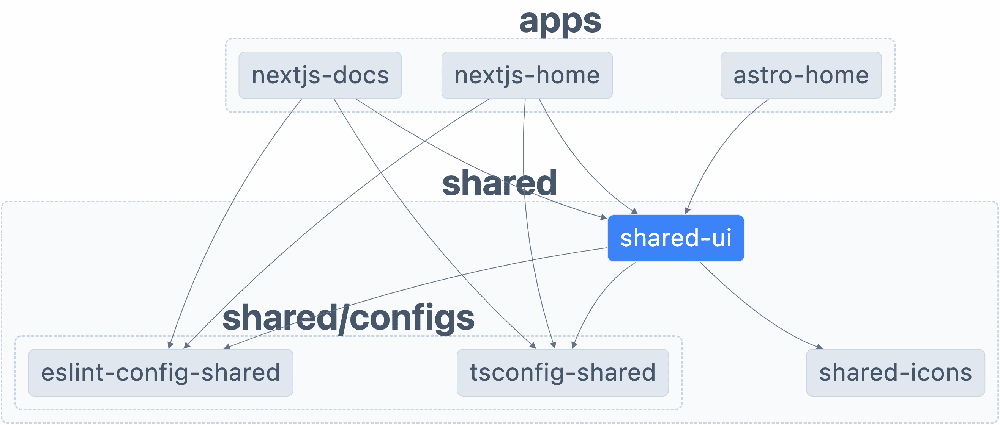

# To Demonstrate or Demolish

Sometimes demonstrating how something works helps understand it.

Along with the ability to demolish what has already been made.

This was started from an official npm starter turborepo, after starting out with
turbo it switched to a nx monorepo.

## What's inside?

This monorepo uses [pnpm](https://pnpm.io/motivation) as a package manager. It
includes the following Apps and Shared Components / Configs:

### Apps and Shared Components / Configs

Everything is 100% [TypeScript](https://www.typescriptlang.org/).

#### Apps

- `astro-home`: an [Astro](https://astro.build/) app; furthest along
- `nextjs-home`: a [Next.js](https://nextjs.org/) app; using the beta app dir
- `vite-home`: a [Vite](https://vitejs.dev/) app; highly experimental

##### Docs

- `docsify-docs`: a [docsify](https://docsify.js.org//) app; standalone and in
  docsify aggregator experiments.
- `nextjs-docs`: a [Next.js](https://nextjs.org/) app; pages, doc centric. Has
  docsify aggregator experiments.
- `vitepress-docs`: a [VitePress](https://vitepress.vuejs.org/) app; doc
  centric. Fits in well with Vite ethos. Can't integrate fully into docsify
  aggregator experiments.

#### Shared Components

- `shared-icons`: a React Component Icon set built from svg-src files
- `shared-ui`: a React UI Component library shared by apps

#### Shared Configs

- `eslint-config-shared`: shared `eslint` configurations (includes
  `eslint-config-prettier` and `eslint-config-next`)
- `tsconfig-shared`: shared `tsconfig.json` used throughout the monorepo

### Utilities

This monorepo has some additional tools already setup for you:

- [TypeScript](https://www.typescriptlang.org/) for static type checking
- [ESLint](https://eslint.org/) for code linting
- [Prettier](https://prettier.io) for code formatting

### Prerequisites to Get Started

Get `pnpm` if you don't have it already. This can be done with `brew`.

```sh
brew install pnpm
# optionally add command line tab-completion for your shell
pnpm install-completion
```

For more information on what those are doing read the
[installation docs](https://pnpm.io/installation#using-homebrew) or the
[shell completion docs](https://pnpm.io/completion).

### Get Started

To get started, run the following command:

```sh
pnpm install
# or use the "i" alias to do the same thing with less typing
pnpm i
# if you are new to pnpm or want a refresher
pnpm -h   # to see all the commands and their aliases
pnpm i -h # to see help for that specific command
```

For more information on
[pnpm CLI commands use their docs](https://pnpm.io/cli/install) as a starting
point. If you're wondering why `pnpm` instead of `npm` see the
[Motivation](https://pnpm.io/motivation) and read other sections of the docs
that look interesting.

### Package Relationships

To understand the dependencies among packages view "the graph":

```sh
pnpm graph
```

That will always give an up to date version, here's what it looks now without
the UI you will get when running locally that is better than this picture.



Having a live version always available helps known how things are organized as
things get built up (demo) and torn down (demo).

### Code Checks and Formatting

You can format the code on the command line:

```sh
pnpm format
```

There are also checks for formating, lint, and typescript:

```sh
pnpm format-check
pnpm lint-check
pnpm type-check
```

These will run for the whole monorepo across all applications and libraries.
There is also a `clean` and `clean-check` using the same naming conventions.

```sh
pnpm clean
pnpm clean-check
```

---

NOTE: below applies less after the shift from `nx` centric to `pnpm` centric
approach happened. It is being left in for now for historical reasons, but
likely to get removed in the future as this repo moves away from `nx` and build
cache concerns in general.

---

### Package Specific Commands

The above were things you can do repository wide for the entire monorepo. To do
things in a more application or library centric way you will use `pnpm` in
combination with `nx` to focus on the parts of the repository you are working
directly with.

Most commands will be run by `pnpm` with `nx` being right after that. You can
see the help for `nx` by running

```sh
pnpm nx -h
```

> the "help" shows `nx.js` not `nx` which is confusing 🥴  
> because if you use `nx.js` it won't work, so use `nx` 🤯

#### Develop

To develop an app run any of the following:

```sh
pnpm nx dev astro-home # 1. short and clear, dropping exec and run because we can
pnpm nx run astro-home:dev # 2. using nx run with colon format for project:target
pnpm exec nx run astro-home:dev # 3. using explicit exec for pnpm, no dlx needed
```

1. This combines both
   [the exec is Sometimes Optional in pnpm](https://pnpm.io/cli/exec#examples)
   with the abilities for
   [nx to Run a Single Task](https://nx.dev/core-features/run-tasks#run-a-single-task)
2. This still uses the optional `exec` because `nx` is not a `pnpm` command
   part, but uses the [nx run](https://nx.dev/packages/nx/documents/run) which
   has a `project:target` format.
3. Explicitly uses `pnpm exec` and `nx run` but otherwise equivalent with the
   others. If you need to download the package because it is not one of the
   dependencies then you can use `dlx` in place of `exec`. These two commands
   are replacements for either `pnpx` or `npx` that you may have used in the
   past that combined the now split `dlx` and `exec` functionality.
4. There are multiple ways to do things like specifying the target in `nx` so
   what is shown is only some of the ways you could run things.

#### Build

There is still more work to figure out of the following commands which match
community norms and the needs on this monorepo applications. Some of the tension
is caused by figuring out SSR (Server-Side Rendering), CSR (Client-Side
Rendering), and Rehydration for
[rendering on the web](https://web.dev/rendering-on-the-web/#terminology). Based
on where that tension heads some of the following will become more relevant.

- build
- serve
- start
- preview

If that rendering on the web TLA
([three-letter acronym](https://en.wikipedia.org/wiki/Three-letter_acronym))
soup has left you dehydrated please take a 🚰 break before venturing into build
caching 🌴 oasis or 🏝️ desert island depending on where things are present or
absent.

#### Build Caching

There is a general need for effective build caching. This can be accomplished
with mature tools like [Bazel](https://bazel.build/) or in a more Turbo specific
way currently with
[Remote Caching](https://turbo.build/repo/docs/core-concepts/remote-caching) at
the build artifact level, or the still in alpha
[Turbo Pack](https://turbo.build/pack/docs/core-concepts) which is intended to
cache smaller build artifacts. Both Turbo (repo and pack) approaches seem like
they are very well integrated with [Vercel the company](https://vercel.com/) and
the other products thay have like
[Next.js](https://vercel.com/solutions/nextjs). It isn't clear if the open
source tools will stand alone from the other projects that Vercel is driving
forward. The leading approach being tried out is leveraging
[Nx Caching](https://nx.dev/concepts/how-caching-works) since that seemed more
mature compared to the Turbo approaches.

## Useful Links

### Nx Builds

- [Caching](https://nx.dev/core-features/cache-task-results)

### Turbo Repo

- [Pipelines](https://turbo.build/repo/docs/core-concepts/monorepos/running-tasks)
- [Caching](https://turbo.build/repo/docs/core-concepts/caching)
- [Remote Caching](https://turbo.build/repo/docs/core-concepts/remote-caching)
- [Filtering](https://turbo.build/repo/docs/core-concepts/monorepos/filtering)
- [Configuration Options](https://turbo.build/repo/docs/reference/configuration)
- [CLI Usage](https://turbo.build/repo/docs/reference/command-line-reference)

### Bazel

- [Bazel Public About](https://bazel.build/about)
- [Bazel Basics](https://bazel.build/basics)
- [When to use Bazel Blog Post](https://earthly.dev/blog/bazel-build/)
- [Stripe Bazel Blog Post](https://stripe.com/blog/fast-secure-builds-choose-two)
- [Caching Explained Blog Post Series](https://sluongng.hashnode.dev/series/bazel-caching-explained)
- [Bazel in CI Blog Post Series](https://sluongng.hashnode.dev/series/bazel-in-ci)

#### Buck and Buck2

- [Alpha Buck2 to replace Buck](https://github.com/facebookincubator/buck2/blob/main/docs/why.md)
